# Console Module
* [clearStdscr](#clearstdscr)
* [putScriptBanner](#putscriptbanner)
* [ConsolePrompt](#consoleprompt)
* [ConsoleTable](#consoletable)
---
### `clearStdscr`
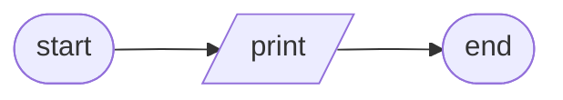
```
clearStdscr(console)
    PUT console.home + console.clear
END
```
---
### `putScriptBanner`

```
putScriptBanner(console, scriptName)
    PUT "Running {scriptName}..."
        + left-justified(console.width)
        + console.reverse
END
```
---
---
## `ConsolePrompt`
* [\_\_init__](#__init__)
* [call](#call)
* [_getResponse](#_getresponse)
* [_validateResponse](#_validateresponse)
* [_readKeystroke](#_readkeystroke)
* [_readString](#_readstring)
* [_checkBoolValidity](#_checkboolvalidity)
* [_checkIntegerValidity](#_checkintegervalidity)
* [_putPrompt](#_putprompt)
* [_putAlert](#_putalert)
* [_printMessage](#_printmessage)
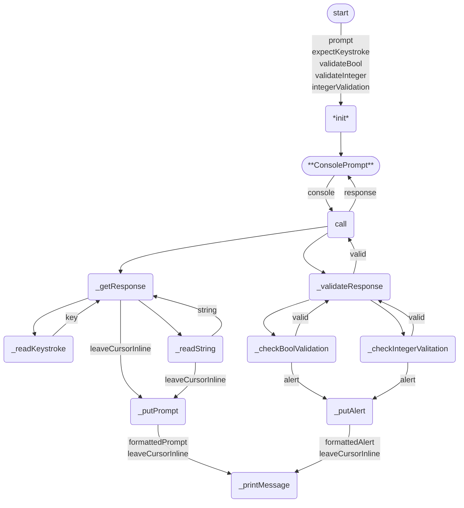
[️⬆️](#console-module)
---
### `__init__`
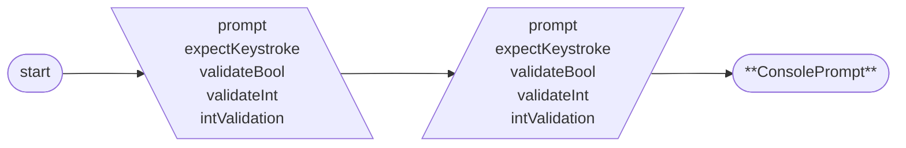
```
init(prompt, expectKeystroke, validateBool, validateInt, intValidation)
    SET self.prompt <- prompt
    SET self.expectKeystroke <- expectKeystroke
    SET self.validateBool <- validateBool
    SET self.validateInt <- validateInt
    SET self.intValidation <- intValidation
END
```
 [️⬆️](#consoleprompt)
---
### `call`
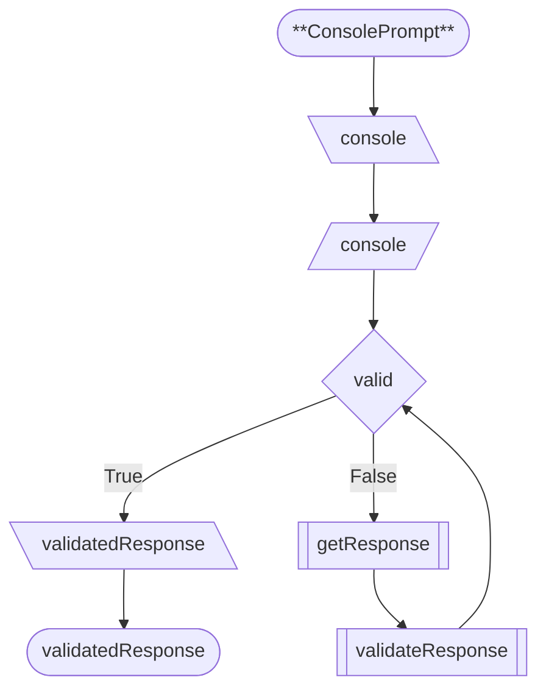
```
call(console)
    SET self.console <- console
    SET valid <- False
    WHILE NOT valid
        getResponse()
        valid <- validateResponse()
    RETURN self.validatedResponse
END
```
 [️⬆️](#consoleprompt)
---
### `_getResponse`
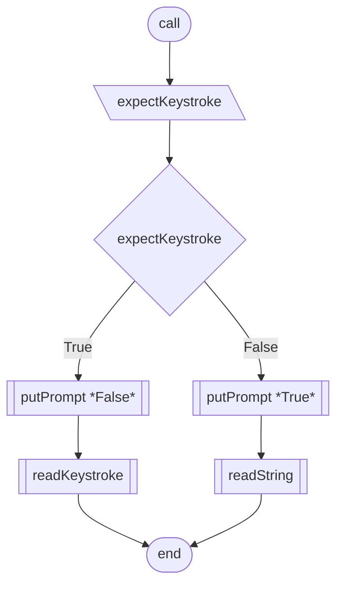
```
getResponse()
    GET self.expectKeystroke
    IF expectKeystroke
        putPrompt(inlineCursor=False)
        userResponse <- readKeystroke()
    ELSE
        putPrompt(inlineCursor=True)
        userResponse <- readString()
END
```
[️⬆️](#consoleprompt)
---
### `_validateResponse`
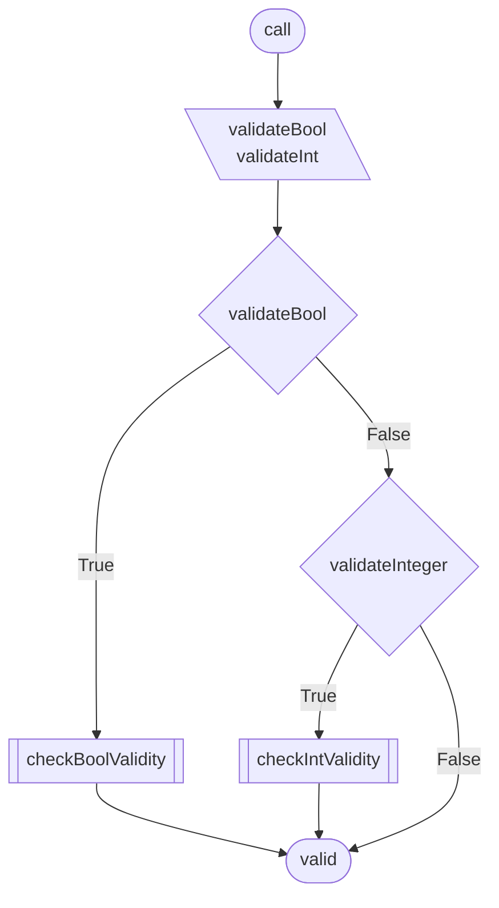
```
validateResponse()
    IF self.validateBool
        RETURN checkBoolValidation()
    IF self.validateInteger
        RETURN checkIntegerValidation()
    RETURN True
END
```
[️⬆️](#consoleprompt)
---
### `_readKeystroke`
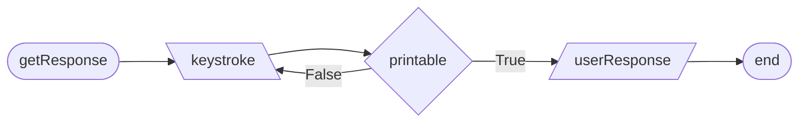
```
_readKeystroke()
    GET keystroke
    SET userResponse <- keystroke
END
```
[️⬆️](#consoleprompt)
---
### `_readString`
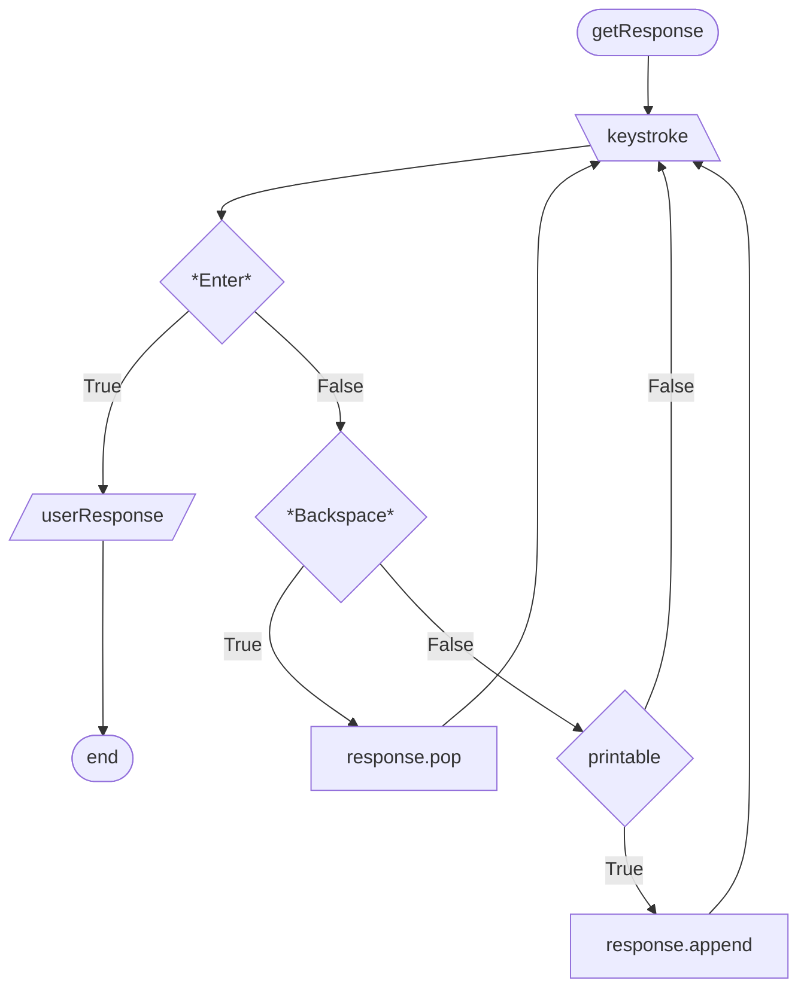
```
readString()
    SET userInput <- []
    WHILE True
        SET key = input()
        IF key == Enter
            BREAK
        IF key == Backspace
            POP userInput
            PUT prompt + userInput
        ELSE
            APPEND userInput + key
            PUT key
    RETURN userInput
END
```
[️⬆️](#consoleprompt)
---
### `_checkBoolValidity`
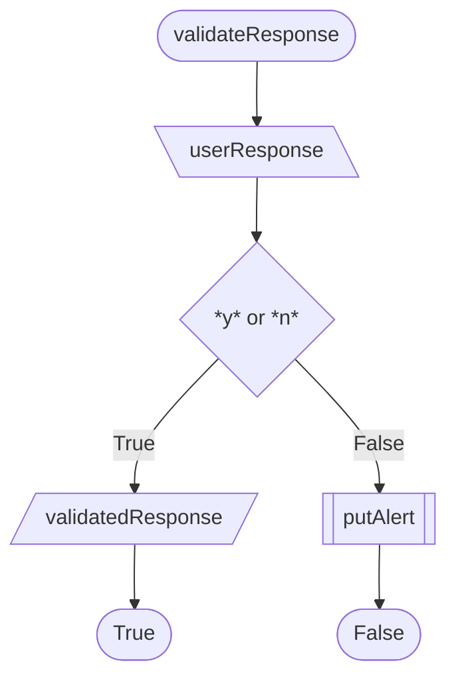
```
checkBoolValidation()
    IF self.userResponse.lower IN {'y', 'n'}
        SET self.validatedResponse <- userResponse == 'y'
        RETURN True
    putAlert()
    RETURN False
```
[️⬆️](#consoleprompt)
---
### `_checkIntegerValidity`
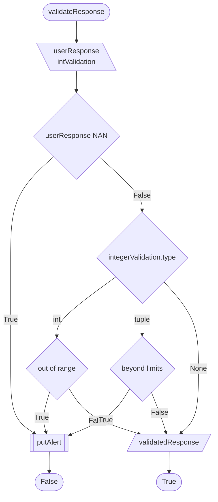
```
checkIntegerValidation()
    IF self.userResponse IS NOT TYPE int
        putAlert(TypeError message)
        RETURN False
    SWITCH self.integerValidation TYPE
        CASE int
            IF userResponse < 0 OR userResponse >= integervalidation
                putAlert(ValueError: exceeds range)
                RETURN False
        CASE tuple
            SET lo, hi <- integervalidation
            IF userResponse < lo OR userResponse > hi
                putAlert(ValueError: exceeds limits)
                RETURN False
        CASE None
            BREAK
    SET self.validatedResponse <- userResponse
```
[️⬆️](#consoleprompt)
---
### `_putPrompt`
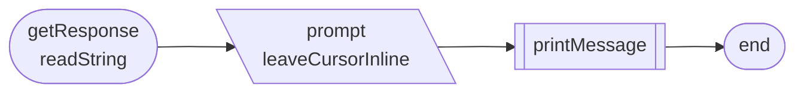
```
putPrompt(leaveCursorInline)
    printMessage(console.brightYellow + prompt, leaveCursorInline)
END
```
[️⬆️](#consoleprompt)
---
### `_putAlert`
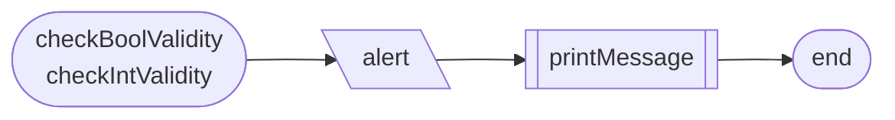
```
putAlert(alert, leaveCursorInline)
    printMessage(console.red + alert, leaveCursorInline)
END
```
[️⬆️](#consoleprompt)
---
### `_printMessage`
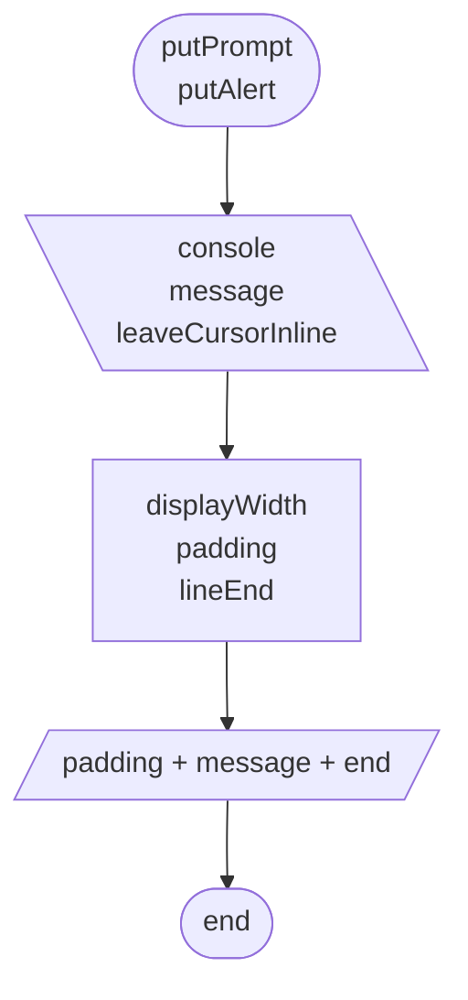
```
printMessage(message, leaveCursorInline)
    SET displayWidth
    SET padding
    WITH leaveCursorInline SET lineEnd
    PUT message
END
```
[️⬆️](#consoleprompt)
---
---
## `ConsoleTable`
* [\_\_init__](#__init__-1)
* [display](#display)
* [_setDimensions](#_setdimensions)
* [_drawTable](#_drawtable)
* [_drawRow](#_drawrow)
* [_getRowEnds](#_getrowends)
* [_getRowContent](#_getrowcontent)
* [_processRowContent](#_processrowcontent)
* [Table](../table/design.md)
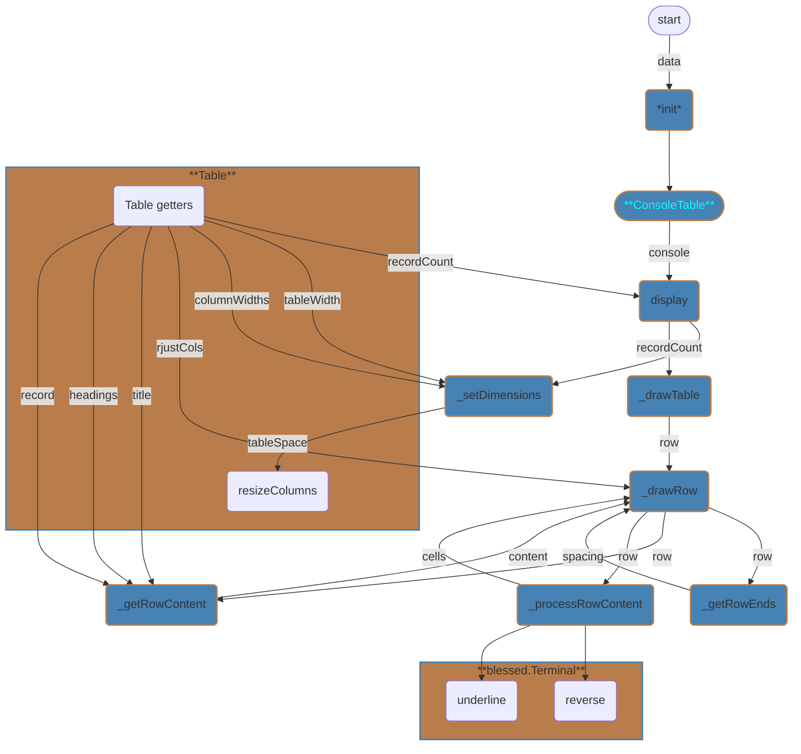
[️⬆️](#console-module)
---
### `__init__`
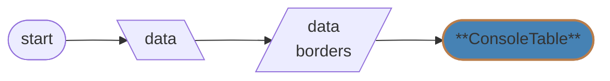
```
init(data)
    SET self.data <- data
    SET self.borders <- {"top": {"left": "╔", "fill": "═", "right": "╗"}, 
                         "inner": {"left": "╟", "fill": "─", "right": "╢"}, 
                         "bottom": {"left": "╚", "fill": "═", "right": "╝"}, 
                         "side": "║"}
END
```
 [️⬆️](#consoletable)
---
### `display`
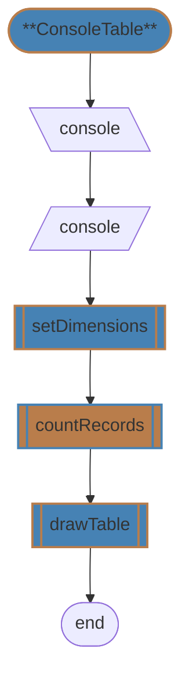
```
display(console)
    SET self.con <- console
    self.setDimensions()
    self.drawTable(self.data.countRecords())
END
```
 [️⬆️](#consoletable)
---
### `_setDimensions`
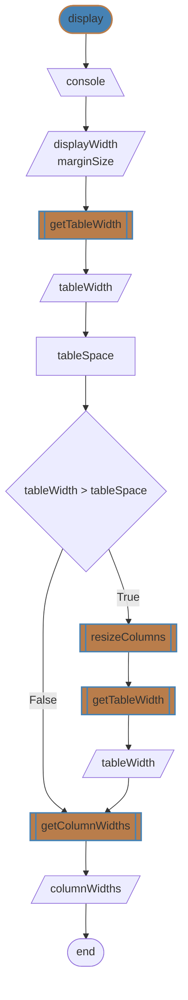
```
setDimensions()
    SET self.displayWidth <- MIN(self.con.width, 79)
    SET self.marginSize <- (con.width - displayWidth) // 2
    SET self.tableWidth <- self.data.getTableWidth()
    SET tableSpace = displayWidth - 4
    IF tableWidth > tableSpace
        data.resizeColumns(tableSpace)
        tableWidth <- data.getTableWidth()
    SET self.columnWidths <- data.getColumnWidths()
END
```
 [️⬆️](#consoletable)
---
### `_drawTable`
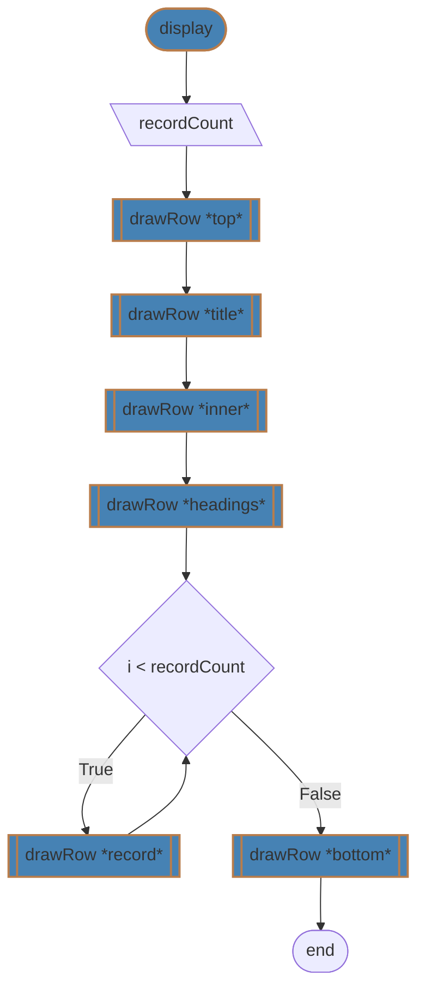
```
drawTable(recordCount)
    self.drawRow("top")
    self.drawRow("title")
    self.drawRow("inner")
    self.drawRow("headings")
    FOR i IN recordCount
        self.drawRow("record", i)
    self.drawRow("bottom")
END
```
 [️⬆️](#consoletable)
---
### `_drawRow`
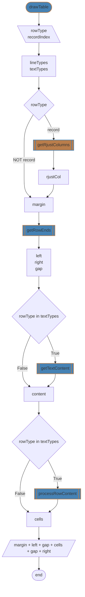
```
drawRow(rowType, recordIndex)
    SET lineTypes <- ["top", "inner", "bottom"]
    SET textTypes <- ["title", "headings", "record"]
    IF rowType == "record"
        SET rjustCol <- self.data.getRjustColumns()
    ELSE
        SET rjustCol <- {}
    SET margin <- " " * self.marginSize
    SET left, right, gap <- self.getRowEnds(rowType, rowType IN lineTypes)
    IF rowType IN textTypes
        SET content <- self.getTextContent(rowType, recordIndex)
    ELSE
        SET content <- self.borders[rowType]["fill"]
    IF rowType IN textTypes
        SET cells <- self.processRowContent(rowType, content, rjustCol)
    ELSE
        SET cells <- content * (self.tableWidth + 2)
    PUT margin + left + gap + cells.join("  ") + gap + right
END
```
 [️⬆️](#consoletable)
---
### `_getRowContent`
```mermaid
flowchart LR
    classDef this fill:#4682b4,stroke:#b97d4b,stroke-width:2px
    classDef that fill:#b97d4b,stroke:#4682b4,stroke-width:2px
    DWRW([drawRow]):::this
        DWRW --> RTIX
    RTIX[\rowType
          index\]
        RTIX --> RTYP
    RTYP{rowType}
        RTYP -- title   --> GTTL
        RTYP -- heading --> GHDG
        RTYP -- record  --> GREC
    GTTL[[getTitle]]:::that
        GTTL --> RTNT
    GHDG[[getHeadings]]:::that
        GHDG --> RTNH
    GREC[[getRecord]]:::that
        GREC --> RTNR
    RTNT([title])
    RTNH([headings])
    RTNR([record])
```
```
getTextContent(rowType, index)
    SWITCH rowType
        CASE "title"
            RETURN self.data.getTitle()
        CASE "headings"
            RETURN self.data.getHeadings()
        CASE "record"
            RETURN self.data.getRecord(index)
END
```
 [️⬆️](#consoletable)
---
### `_getRowEnds`
```mermaid
flowchart
    classDef this fill:#4682b4,stroke:#b97d4b,stroke-width:2px
    DWRW([drawRow]):::this
        DWRW --> RTLT
    RTLT[\rowType
          isLineType\]
        RTLT --> ISLT
    ISLT{isLineType}
        ISLT -- True  --> GBRT
        ISLT -- False --> GBSD
    GBRT[\borders.rowType\]
        GBRT --> SLRP
    GBSD[\borders.side\]
        GBSD --> SLRP
    SLRP[leftEnd
         rightEnd
         padding]
        SLRP --> RTRN
    RTRN([left
          right
          gap])
```
```
getRowEnds(rowType, isLineType)
    IF isLineType
        SET leftEnd <- self.borders[rowType]["left"]
        SET rightEnd <- self.borders[rowType]["right"]
        SET padding <- ""
    ELSE
        SET leftEnd, rightEnd <- self.borders["side"]
        SET padding <- " "
    RETURN leftEnd, rightEnd, padding
END
```
 [️⬆️](#consoletable)
---
### `_processRowContent`
```mermaid
flowchart
    classDef this fill:#4682b4,stroke:#b97d4b,stroke-width:2px
    classDef that fill:#b97d4b,stroke:#4682b4,stroke-width:2px
    DWRW([drawRow]):::this
        DWRW --> TCRJ
    TCRJ[\rowType
          content
          rjustCol\]
        TCRJ --> RTTL
    RTTL{rowType == title}
        RTTL -- True  --> SCTL
        RTTL -- False --> IINC
    SCTL[cell]
        SCTL --> APC1
    APC1[cells]
        APC1 --> RTRN
    IINC{item in content}
        IINC -- True  --> GCLW
        APC2          --> IINC
        IINC -- False --> RTRN
    GCLW[\columnWidth\]
        GCLW --> RTHD
    RTHD{rowType == headings}
        RTHD -- True  --> SCHD
        RTHD -- False --> KRJC
    SCHD[cell]
        SCHD --> APC2
    KRJC{key in rjustCol}
        KRJC -- True  --> SCRJ
        KRJC -- False --> SCLJ
    SCRJ[cell]
        SCRJ --> APC2
    SCLJ[cell]
        SCLJ --> APC2
    APC2[cells]
    RTRN([cells])
```
```
processRowContent(rowType, content, rjusCol)
    SET cells <- []
    IF rowType == "title"
        SET cell <- centered content in reverse
        APPEND cell TO cells
    ELSE
        FOR key, value IN content
            GET self.columnWidths[key]
            IF rowType == "headings"
                SET cell <- centered value in underline
            ELSE
                IF key IN rjustCol
                    SET cell <- right-justified value
                ELSE
                    SET cell <- left-justified value
            APPEND cell TO cells
    RETURN cells
END
```
 [️⬆️](#consoletable)
---
