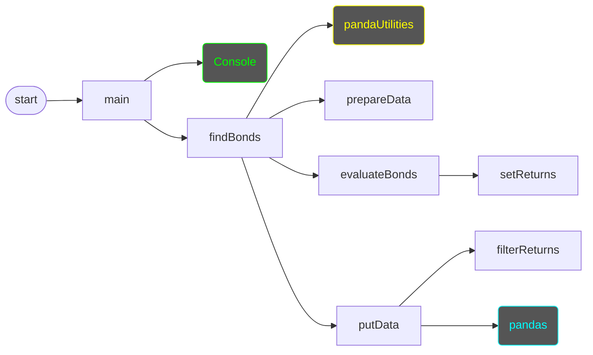
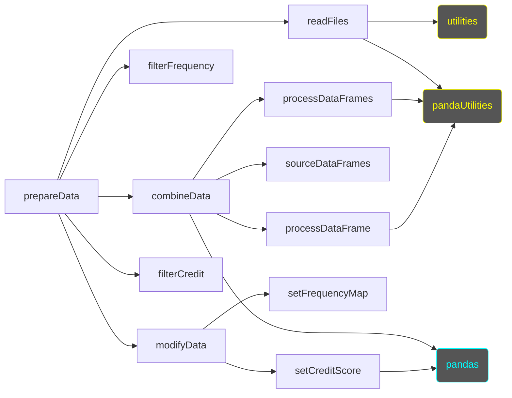
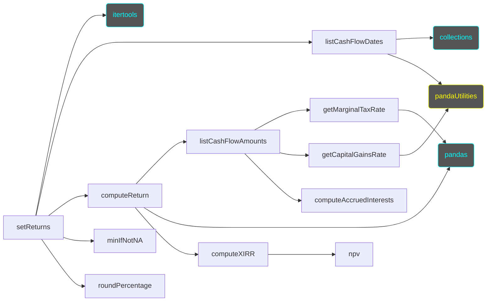

# getBonds Script
## Structure Charts
### Overview

#### `prepareData()`

#### `setReturns()`

## Module and Classes
* [commands](commands.md)
* [Console](console.md#console)
* [Console](console.md#consoleprompt)
* [Console](console.md#consoletable)
* [Menu](menu.md)
* [Table](table.md)
