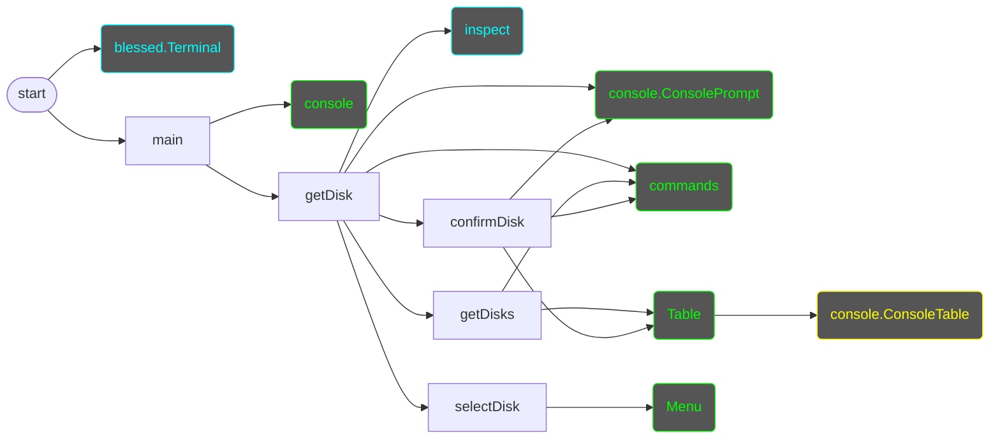

# getDisk Script

```mermaid
flowchart LR
    classDef complete color:#0f0,stroke:#0f0,fill:#555
    classDef working color:#ff0,stroke:#ff0,fill:#555
    classDef library color:#0ff,stroke:#0ff,fill:#555

    %% Structure
    IF([start])
        IF --> TRM
        IF --> MAIN
    MAIN[main]
        MAIN --> CON
        MAIN --> GD
    GD[getDisk]
        GD --> INSP
        GD --> GDS
        GD --> CCP
        GD --> SD
        GD --> CD
        GD --> CMD
    GDS[getDisks]
        GDS --> CMD
        GDS --> TBL
    SD[selectDisk]
        SD --> MNU
    CD[confirmDisk]
        CD --> CMD
        CD --> TBL
        CD --> CCP

    %% Modules
    TRM(blessed.Terminal):::library
    INSP(inspect):::library
    CMD(commands):::complete
    CON(console):::complete
    CCP(console.ConsolePrompt):::complete
    CCT(console.ConsoleTable):::working
    TBL(Table):::complete
        TBL --> CCT
    MNU(Menu):::complete
```
* [commands](commands.md)
* [console](console.md)
* [Menu](menu.md)
* [Table](table.md)
