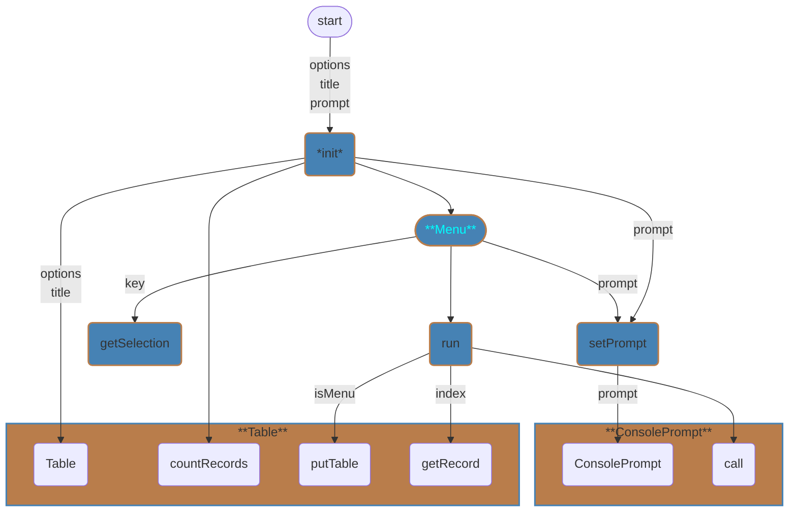
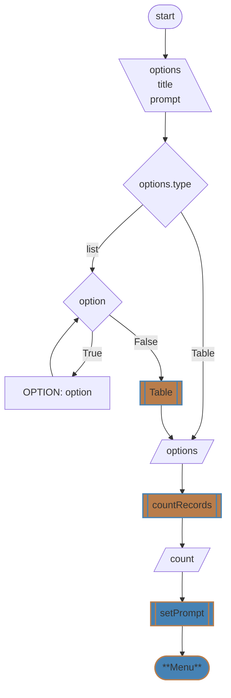
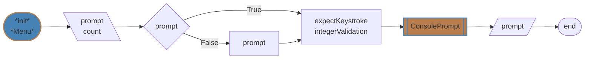
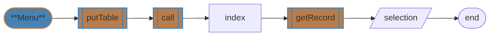
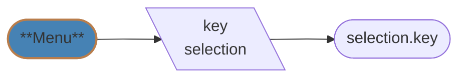

# Menu Module
## `Menu`
| Constructor | Public Methods | Dependencies |
| --- | --- | --- |
| [\_\_init__](#__init__) | [setPrompt](#setprompt) | [Table](table.md) |
| | [run](#run) | [ConsolePrompt](console.md) |
| | [getSelection](#getselection) | |


---
### `__init__`

```
init(options, title, prompt)
    IF options.type IS Table
        SET self.options <- options
    ELSE
        FOR option IN options
            SET data["OPTION"] <- option
        SET self.options <- Table(title, data)
    SET self.count <- self.options.countRecords()
    self.setPrompt(prompt)
END
```
[️⬆️](#menu)
---
### `setPrompt`

```
setPrompt(prompt)
    IF NOT prompt
        SET prompt
    SET expectKeystroke <- self.count < 10
    SET integerValidation <- (1, self.count)
    SET self.prompt <- ConsolePrompt(prompt, expectKeystroke, 
                                     validateInteger=True, integerValidation)
END
```
[️⬆️](#menu)
---
### `run`

```
run(console)
    self.options.putTable(isMenu=True)
    SET index <- self.prompt.call() - 1
    SET self.selection <- self.options.getRecord(index)
END
```
[️⬆️](#menu)
---
### `getSelection`

```
getSelection(key)
    RETURN self.selection[key]
END
```
[️⬆️](#menu)
---
