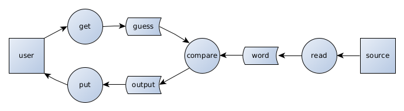

# Wordle
A word-guessing game in which the user guesses a word with a known number of letters.
* The user must guess a real word.
* In-position and out-of-position letters are shown.

## Data Flow Diagram

## Structure Chart
