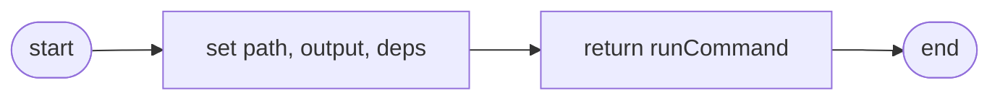
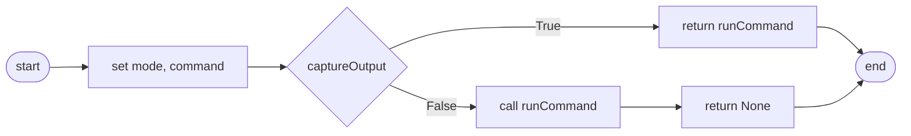
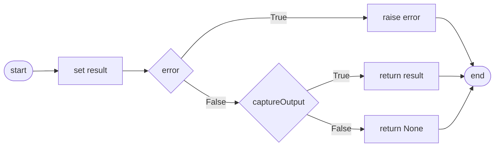
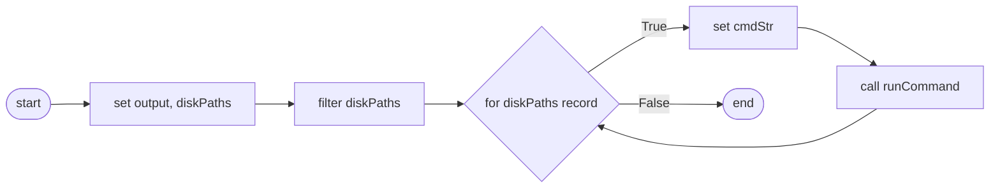

# Commands Module
* [listBlockDevices](#listblockdevices)
* [runBadblocks](#runbadblocks)
* [runCommand](#runcommand)
* [unmountDisk](#unmountdisk)
---
### `listBlockDevices`

```
listBlockDevices(disk, columns, showDependents)
    IF disk
        SET path <- ""
    ELSE
        SET path <- "/dev/{disk}"
    IF columns
        SET columnString <- columns.join(,)
        SET output <- "--output {columnString}"
    ELSE
        SET output <- ""
    IF showDependents
        SET deps <- ""
    ELSE
        SET deps <- "--nodeps"
    RETURN runCommand("lsblk {deps} {output} {path}")
END
```
---
### `runBadblocks`

```
runBadblocks(disk, nonDestructive, captureOutput)
    IF nonDestructive
        SET mode <- "--non-destructive"
    ELSE
        SET mode <- "--write-mode"
    SET command <- "sudo badblocks {mode} --show-progress --verbose /dev/{disk}"
    IF captureOutput
        RETURN runCommand(command)
    runCommand(command, captureOutput)
    RETURN None
END
```
---
### `runCommand`

```
runCommand(command, captureOutput, useShell)
    IF captureOutput
        SET result <- subprocess.run(command, captureOutput, useShell)
    ELSE
        SET result <- subprocess.run(command, stdout, stderr, useShell)
    IF result.returncode != 0
        SET errorMessage <- result.stderr
        RAISE RuntimeError(errorMessage)
    IF captureOutput
        RETURN result.stdout
    ELSE
        RETURN None
END
```
---
### `unmountDisk`

```
unmountDisk(disk)
    SET output <- runCommand("lsblk --output PATH,MOUNTPOINT /dev/{disk}")
    SET diskPaths <- Table(output)
    diskPaths.filterNonempty("MOUNTPOINT")
    FOR i IN diskPaths.countRecords().range
        cmdStr <- "sudo umount --verbose {disk_paths.get_record(i)['PATH']}"
        runCommand(cmdStr, captureOutput=False)
END
```