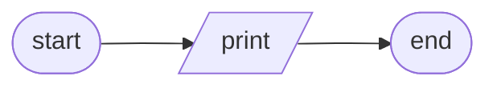
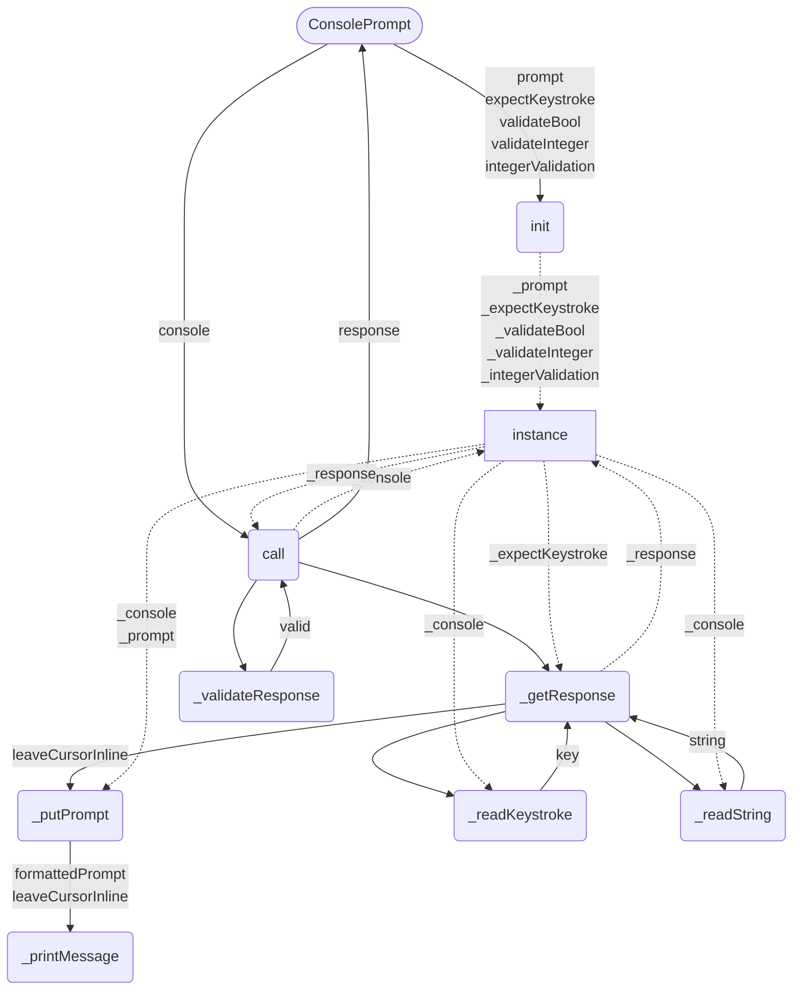

# Console Module
* [clearStdscr](#clearstdscr)
* [putScriptBanner](#putscriptbanner)
* [ConsolePrompt](#consoleprompt)
* [ConsoleTable](#consoletable)
### `clearStdscr`

```
void clearStdscr(Terminal console)
    PUT console.home + console.clear
END
```
### `putScriptBanner`

```
void putScriptBanner(Terminal console, string scriptName)
    PUT "Running {scriptName}..."
        + left-justified(console.width)
        + console.reverse
END
```
## `ConsolePrompt`

## `ConsoleTable`
