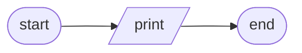
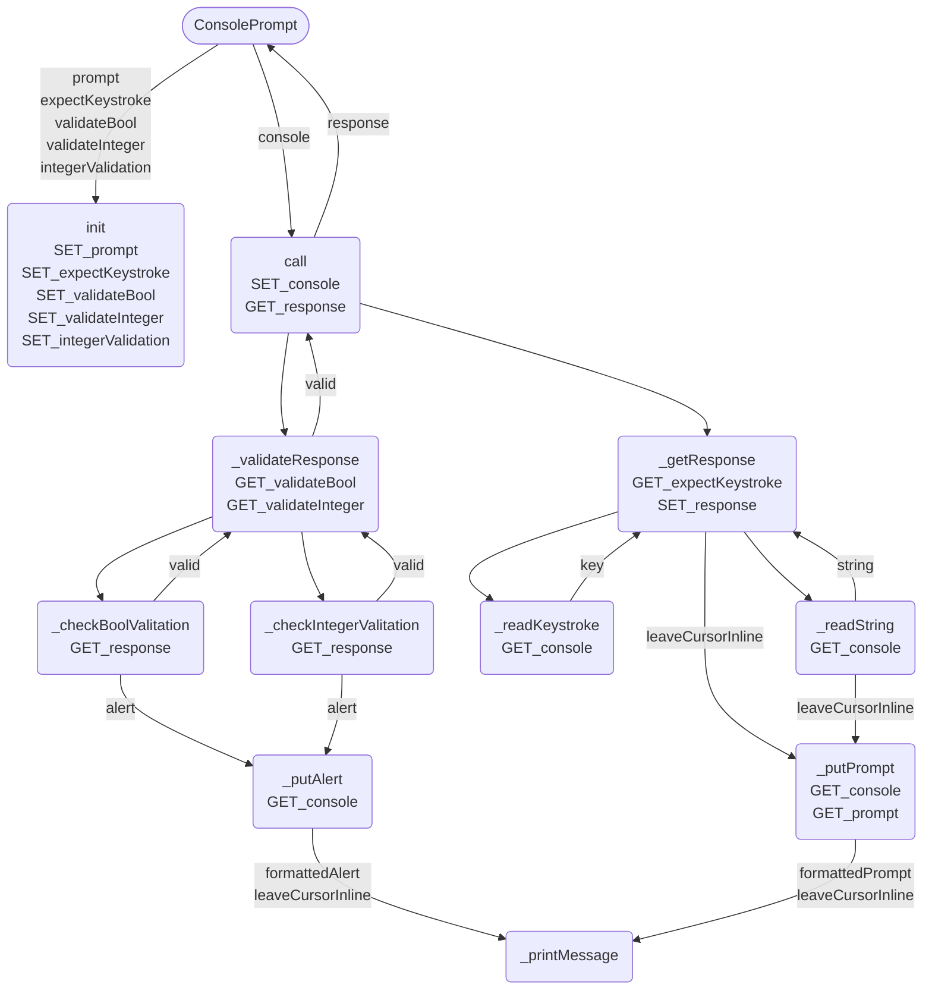
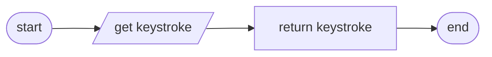
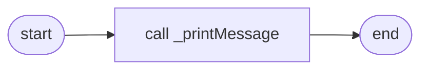
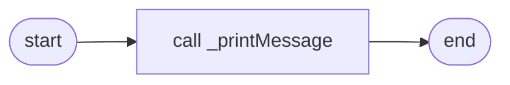

# Console Module
* [clearStdscr](#clearstdscr)
* [putScriptBanner](#putscriptbanner)
* [ConsolePrompt](#consoleprompt)
* [ConsoleTable](#consoletable)
### `clearStdscr`

```
clearStdscr(console)
    PUT console.home + console.clear
END
```
### `putScriptBanner`

```
putScriptBanner(console, scriptName)
    PUT "Running {scriptName}..."
        + left-justified(console.width)
        + console.reverse
END
```
## `ConsolePrompt`

* [_readKeystroke](#_readkeystroke)
* [_readString](#_readstring)
* [_putPrompt](#_putprompt)
* [_putAlert](#_putalert)
* [_printMessage](#_printmessage)
### `_readKeystroke`

```
_readKeystroke()
    GET keystroke
    RETURN keystroke
END
```
### `_readString`

```
_readString()
    ...
END
```
### `_putPrompt`

```
_putPrompt(leaveCursorInline)
    CALL _printMessage(_console.brightYellow + _prompt, leaveCursorInline)
END
```
### `_putAlert`

```
_putAlert(alert, leaveCursorInline)
    CALL _printMessage(_console.red + alert, leaveCursorInline)
END
```
### `_printMessage`

```
_printMessage(message, leaveCursorInline)
    SET displayWidth
    SET padding
    WITH leaveCursorInline SET lineEnd
    PUT message
END
```
## `ConsoleTable`
