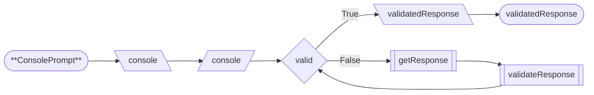
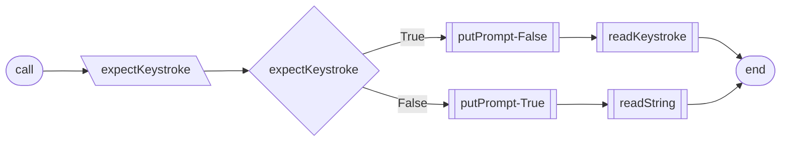

# Console Module
* [clearStdscr](#clearstdscr)
* [putScriptBanner](#putscriptbanner)
* [ConsolePrompt](#consoleprompt)
* [ConsoleTable](#consoletable)
---
### `clearStdscr`

```
clearStdscr(console)
    PUT console.home + console.clear
END
```
---
### `putScriptBanner`

```
putScriptBanner(console, scriptName)
    PUT "Running {scriptName}..."
        + left-justified(console.width)
        + console.reverse
END
```
---
---
## `ConsolePrompt`
* [\_\_init__](#__init_)
* [call](#call)
* [_getResponse](#_getresponse)
* [_validateResponse](#_validateresponse)
* [_readKeystroke](#_readkeystroke)
* [_readString](#_readstring)
* [_checkBoolValidation](#_checkboolvalidation)
* [_checkIntegerValidation](#_checkintegervalidation)
* [_putPrompt](#_putprompt)
* [_putAlert](#_putalert)
* [_printMessage](#_printmessage)

[️⬆️](#console-module)
---
### `__init__`

```
init(prompt, expectKeystroke, validateBool, validateInt, intValidation)
    SET self.prompt <- prompt
    SET self.expectKeystroke <- expectKeystroke
    SET self.validateBool <- validateBool
    SET self.validateInt <- validateInt
    SET self.intValidation <- intValidation
END
```
 [️⬆️](#consoleprompt)
---
### `call`

```
call(console)
    SET self.console <- console
    SET valid <- False
    WHILE NOT valid
        getResponse()
        valid <- validateResponse()
    RETURN self.validatedResponse
END
```
 [️⬆️](#consoleprompt)
---
### `_getResponse`

```
getResponse()
    GET self.expectKeystroke
    IF expectKeystroke
        putPrompt(inlineCursor=False)
        userResponse <- readKeystroke()
    ELSE
        putPrompt(inlineCursor=True)
        userResponse <- readString()
END
```
[️⬆️](#consoleprompt)
---
### `_validateResponse`

```
validateResponse()
    IF self.validateBool
        RETURN checkBoolValidation()
    IF self.validateInteger
        RETURN checkIntegerValidation()
    RETURN True
END
```
[️⬆️](#consoleprompt)
---
### `_readKeystroke`

```
_readKeystroke()
    GET keystroke
    SET userResponse <- keystroke
END
```
[️⬆️](#consoleprompt)
---
### `_readString`

```
readString()
    SET userInput <- []
    WHILE True
        SET key = input()
        IF key == Enter
            BREAK
        IF key == Backspace
            POP userInput
            PUT prompt + userInput
        ELSE
            APPEND userInput + key
            PUT key
    RETURN userInput
END
```
[️⬆️](#consoleprompt)
---
### `_putPrompt`

```
putPrompt(leaveCursorInline)
    printMessage(console.brightYellow + prompt, leaveCursorInline)
END
```
[️⬆️](#consoleprompt)
---
### `_checkBoolValidation`

```
checkBoolValidation()
    IF self.userResponse.lower IN {'y', 'n'}
        SET self.validatedResponse <- userResponse == 'y'
        RETURN True
    putAlert()
    RETURN False
```
[️⬆️](#consoleprompt)
---
### `_checkIntegerValidation`

```
checkIntegerValidation()
    IF self.userResponse IS NOT TYPE int
        putAlert(TypeError message)
        RETURN False
    SWITCH self.integerValidation TYPE
        CASE int
            IF userResponse < 0 OR userResponse >= integervalidation
                putAlert(ValueError: exceeds range)
                RETURN False
        CASE tuple
            SET lo, hi <- integervalidation
            IF userResponse < lo OR userResponse > hi
                putAlert(ValueError: exceeds limits)
                RETURN False
        CASE None
            BREAK
    SET self.validatedResponse <- userResponse
```
[️⬆️](#consoleprompt)
---
### `_putAlert`

```
putAlert(alert, leaveCursorInline)
    printMessage(console.red + alert, leaveCursorInline)
END
```
[️⬆️](#consoleprompt)
---
### `_printMessage`

```
printMessage(message, leaveCursorInline)
    SET displayWidth
    SET padding
    WITH leaveCursorInline SET lineEnd
    PUT message
END
```
[️⬆️](#consoleprompt)
---
---
## `ConsoleTable`
