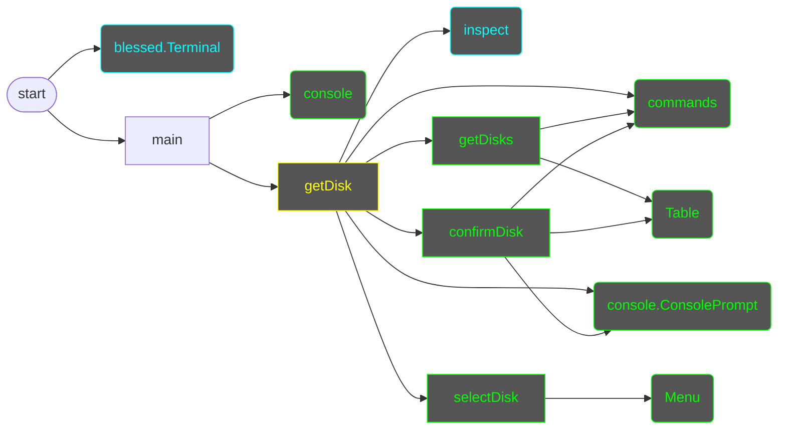

# getDisk Script

```mermaid
flowchart LR
    classDef complete color:#0f0,stroke:#0f0,fill:#555
    classDef working color:#ff0,stroke:#ff0,fill:#555
    classDef library color:#0ff,stroke:#0ff,fill:#555

    %% Structure
    IF([start])
        IF --> TRM
        IF --> MAIN
    MAIN[main]
        MAIN --> CON
        MAIN --> GD
    GD[getDisk]:::working
        GD --> INSP
        GD --> GDS
        GD --> CCP
        GD --> SD
        GD --> CD
        GD --> CMD
    GDS[getDisks]:::complete
        GDS --> CMD
        GDS --> TBL
    SD[selectDisk]:::complete
        SD --> MNU
    CD[confirmDisk]:::complete
        CD --> CMD
        CD --> TBL
        CD --> CCP

    %% Modules
    TRM(blessed.Terminal):::library
    INSP(inspect):::library
    CON(console):::complete
    CMD(commands):::complete
    TBL(Table):::complete
    CCP(console.ConsolePrompt):::complete
    MNU(Menu):::complete
```
* [commands](../commands/design.md)
* [console](../console/design.md)
* [Menu](../menu/design.md)
* [Table](../table/design.md)
