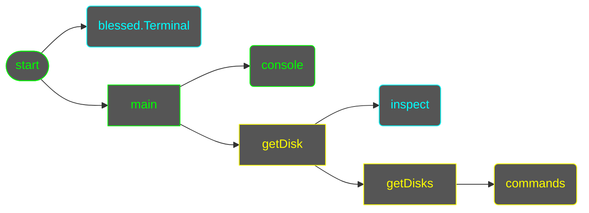

# getDisk Script

```mermaid
flowchart LR
    classDef complete color:#0f0,stroke:#0f0,fill:#555
    classDef working color:#ff0,stroke:#ff0,fill:#555
    classDef library color:#0ff,stroke:#0ff,fill:#555
    IF([start])
        IF:::complete
        IF --> TRM
        IF --> MAIN
    TRM(blessed.Terminal)
        TRM:::library
    MAIN[main]
        MAIN:::complete
        MAIN --> CON
        MAIN --> GD
    CON(console)
        CON:::complete
    GD[getDisk]
        GD:::working
        GD --> INSP
        GD --> GDS
    INSP(inspect)
        INSP:::library
    GDS[getDisks]
        GDS:::working
        GDS --> CMD
    CMD(commands)
        CMD:::working
```