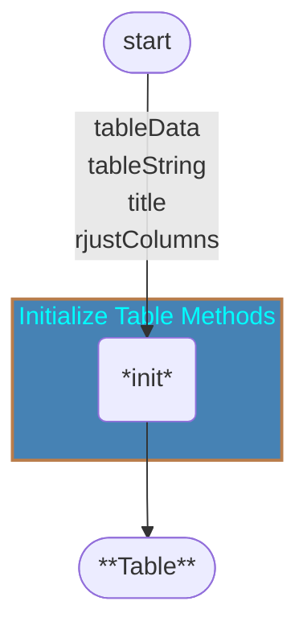
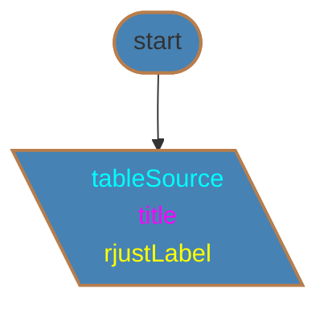

# Menu Module
## `Menu`
### Method Groups
* [Initialize Table Methods](#initialize-table-methods)
#### Initialize Table Methods
* [\_\_init__](#__init__)

[️⬆️](#method-groups)
---
##### `__init__`

```
init(tableData, tableString, title, rjustColLabel)
END
```
[️⬆️](#initialize-table-methods)
---
