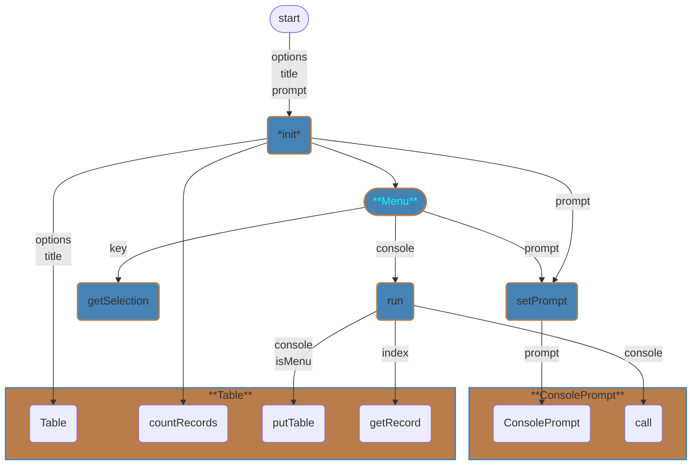
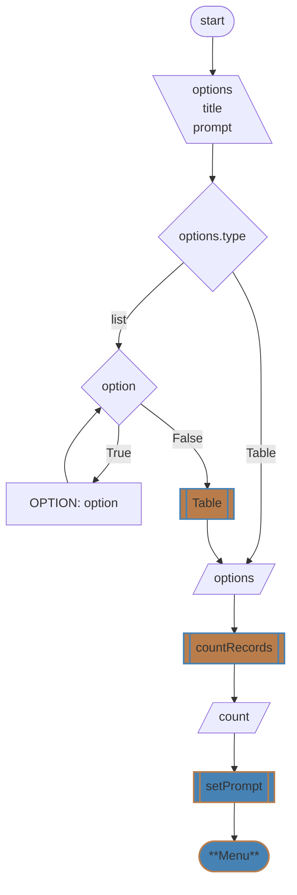

# Menu Module
## `Menu`
* [\_\_init__](#__init__)
* [setPrompt](#setprompt)
* [run](#run)
* [getSelection](#getselection)
* [Table](../table/design.md)
* [ConsolePrompt](../console/design.md)

---
### `__init__`

```
init(options, title, prompt)
    IF options.type IS Table
        SET self.options <- options
    ELSE
        FOR option IN options
            SET data["OPTION"] <- option
        SET self.options <- Table(title, data)
    SET self.count <- self.options.countRecords()
    self.setPrompt(prompt)
END
```
[️⬆️](#menu)
---
### `setPrompt`
```
content
```
[️⬆️](#menu)
---
### `run`
```
content
```
[️⬆️](#menu)
---
### `getSelection`
```
content
```
[️⬆️](#menu)
---
