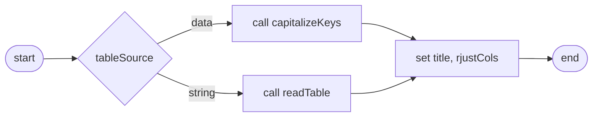
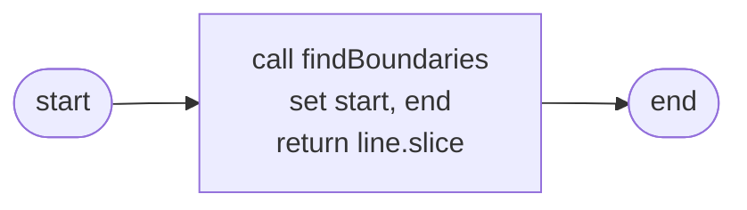

# Table Module
## `Table`
* [\_\_init__](#__init__)
* [_capitalizeKeys](#_capitalizekeys)
* [_readTable](#_readtable)
* [_findColumnPositions](#_findcolumnpositions)
* [_getSlice](#_getslice)
* [_findBoundaries](#_findboundaries)

[️⬆️](#table-module)
---
### `__init__`

```
init(tableData, tableString, title, rjustColumns)
    IF (tableData IS None) == (tableString IS None)
        RAISE ValueError
    IF tableData
        CALL capitalizeKeys
    ELSE
        CALL readTable
    SET title
    SET rjustColumns
END
```
[️⬆️](#table)
---
### `_capitalizeKeys`

```
capitalize_keys(data)
    SET self.dataset <- []
    FOR datum IN data
        FOR key, value IN datum
            SET datum[key.upper] <- value
        APPEND datum TO self.dataset
    SET self.recordsCount <- self.dataset.length
```
[️⬆️](#table)
---
### `_readTable`

```
readTable(string)
    SET lines <- string.splitlines
    SET headers <- lines[0].split
    SET columnPositions <- findColumnPositions()
    FOR line IN lines
        FOR header, index in headers
            SET value <- getSlice()
            SET datum[header.upper] <- value
        APPEND datum TO self.dataset
    SET self.recordsCount <- self.dataset.length
```
[️⬆️](#table)
---
### `_findColumnPositions`

```
findColumnPositions(headerLine, keys)
    SET positions <- []
    FOR key IN keys
        SET position <- headerLine.index OF key
        APPEND position TO positions
    RETURN positions
```
[️⬆️](#table)
---
### `_getSlice`

```
getSlice(columnIndex, positionsList, line)
    SET start, end <- findBoundaries(columnIndex, positionsList, line)
    RETURN line[start:end]
```
[️⬆️](#table)
---
### `_findBoundaries`

```
findBoundaries(columnIndex, positionsList, line)

    # Initial start and end positions
    SET start <- positionsList[columnIndex]
    IF columnIndex + 1 < positionsList.length
        SET end <- positionsList[columnIndex + 1]
    ELSE
        SET end <- line.length

    # Adjust start position
    IF start < line.length
        IF line[start] == " "
            WHILE start < end && line[start] == " "
                start += 1
        ELSE
            WHILE start > 0 && line[start - 1] != " "
                start -= 1
    ELSE
        start = line.length

    # Adjust end position
    IF end < line.length
        WHILE end > start && line[end] != " "
            end -= 1
        WHILE end > start && line[end - 1] == " "
            end -= 1
    ELSE:
        end = line.length
    
    RETURN start, end
```
[️⬆️](#table)
---
