# Table Module
## `Table`
### Method Groups
* [Initialize Table Methods](#initialize-table-methods)
* [Modify Table Methods](#modify-table-methods)
* [Display Table Methods](#display-table-methods)
* [Getters](#getters)
#### Initialize Table Methods
* [\_\_init__](#__init__)
* [_capitalizeKeys](#_capitalizekeys)
* [_readTable](#_readtable)
* [_findColumnPositions](#_findcolumnpositions)
* [_getSlice](#_getslice)
* [_findBoundaries](#_findboundaries)
* [_addRjustColLabel](#_addrjustcollabel)
```mermaid
graph
    TABL([**Table**])
        TABL -- tableData
                tableString
                title
                rjustColumns --> INIT
    subgraph i [Initialize Table Methods]
        INIT(*init*)
            INIT -- tableData   --> CAPK
            INIT -- tableString --> READ
        CAPK(_capitalizeKeys)
        READ(_readTable)
            READ -- headerLine
                    keys            --> FNDC
            FNDC -- columnPositions --> READ
            READ -- columnIndex
                    positionsList
                    line            --> GETS
            GETS -- slice           --> READ
        FNDC(_findColumnPositions)
        GETS(_getSlice)
            GETS -- columnIndex
                    positionsList
                    line          --> FNDB
            FNDB -- boundaries    --> GETS
        FNDB(_findBoundaries)
    end
    subgraph d [Display Table Methods]
        NUMR(_numberRecords)
    end
    ARJC(_addRjustColLabel)
        INIT -- rjustColumns --> ARJC
        NUMR                 --> ARJC
```
[️⬆️](#method-groups)
---
##### `__init__`
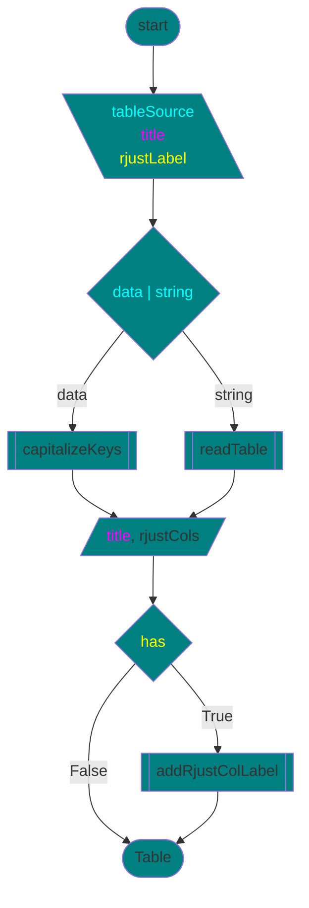
```
init(tableData, tableString, title, rjustColLabel)
    IF (tableData IS None) == (tableString IS None)
        RAISE ValueError
    IF tableData
        CALL capitalizeKeys
    ELSE
        CALL readTable
    SET title
    SET rjustColumns
    IF rjustColLabel
        CALL addRjustColLabel
END
```
[️⬆️](#initialize-table-methods)
---
##### `_capitalizeKeys`
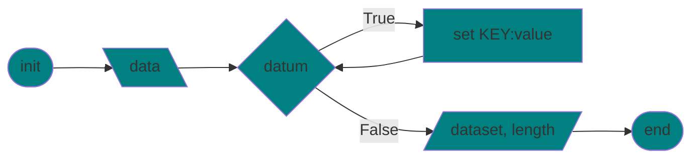
```
capitalize_keys(data)
    SET self.dataset <- []
    FOR datum IN data
        FOR key, value IN datum
            SET datum[key.upper] <- value
        APPEND datum TO self.dataset
    SET self.recordsCount <- self.dataset.length
```
[️⬆️](#initialize-table-methods)
---
##### `_readTable`
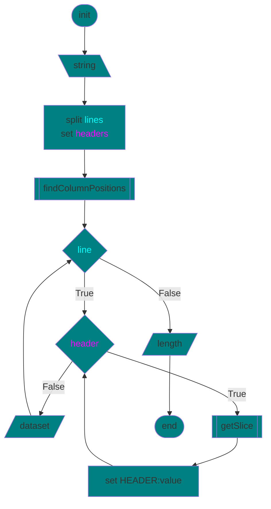
```
readTable(string)
    SET lines <- string.splitlines
    SET headers <- lines[0].split
    SET columnPositions <- findColumnPositions()
    FOR line IN lines
        FOR header, index in headers
            SET value <- getSlice()
            SET datum[header.upper] <- value
        APPEND datum TO self.dataset
    SET self.recordsCount <- self.dataset.length
```
[️⬆️](#initialize-table-methods)
---
##### `_findColumnPositions`
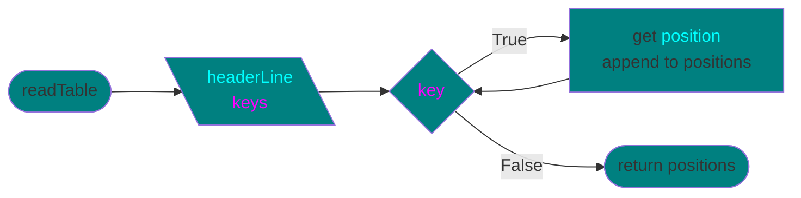
```
findColumnPositions(headerLine, keys)
    SET positions <- []
    FOR key IN keys
        SET position <- headerLine.index OF key
        APPEND position TO positions
    RETURN positions
```
[️⬆️](#initialize-table-methods)
---
##### `_getSlice`

```
getSlice(columnIndex, positionsList, line)
    SET start, end <- findBoundaries(columnIndex, positionsList, line)
    RETURN line[start:end]
```
[️⬆️](#initialize-table-methods)
---
##### `_findBoundaries`
###### Overview
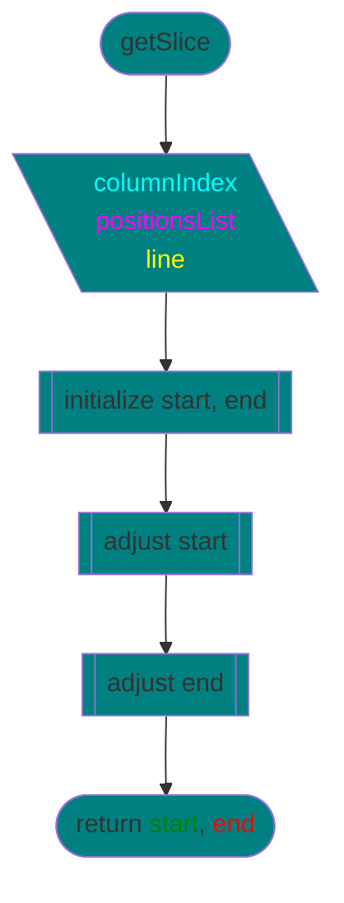
###### Initialize Subgraph
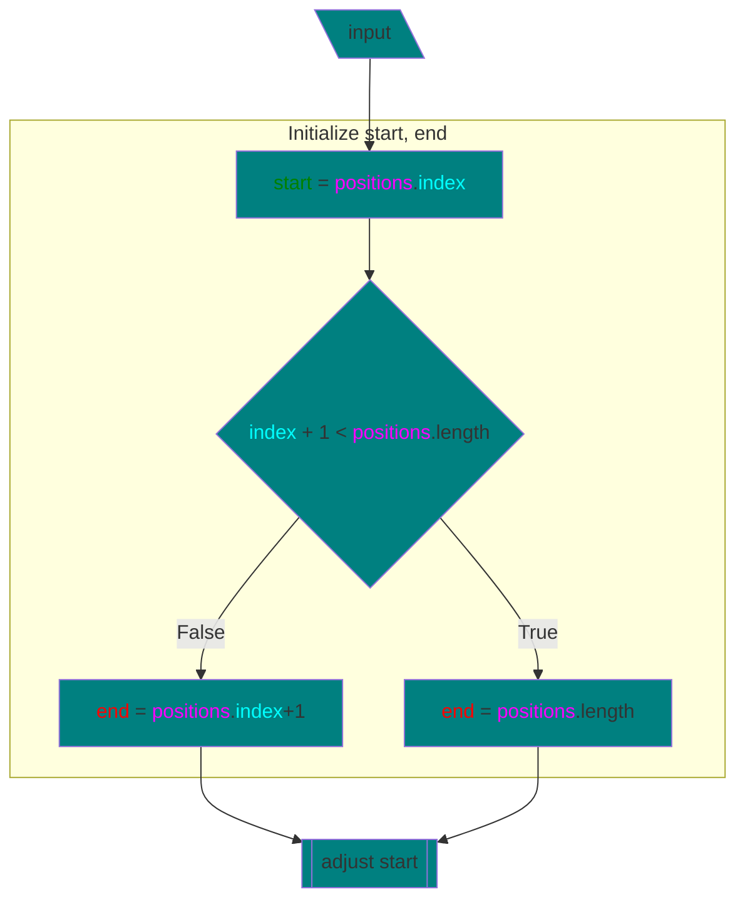
###### Start Subgraph

###### End Subgraph
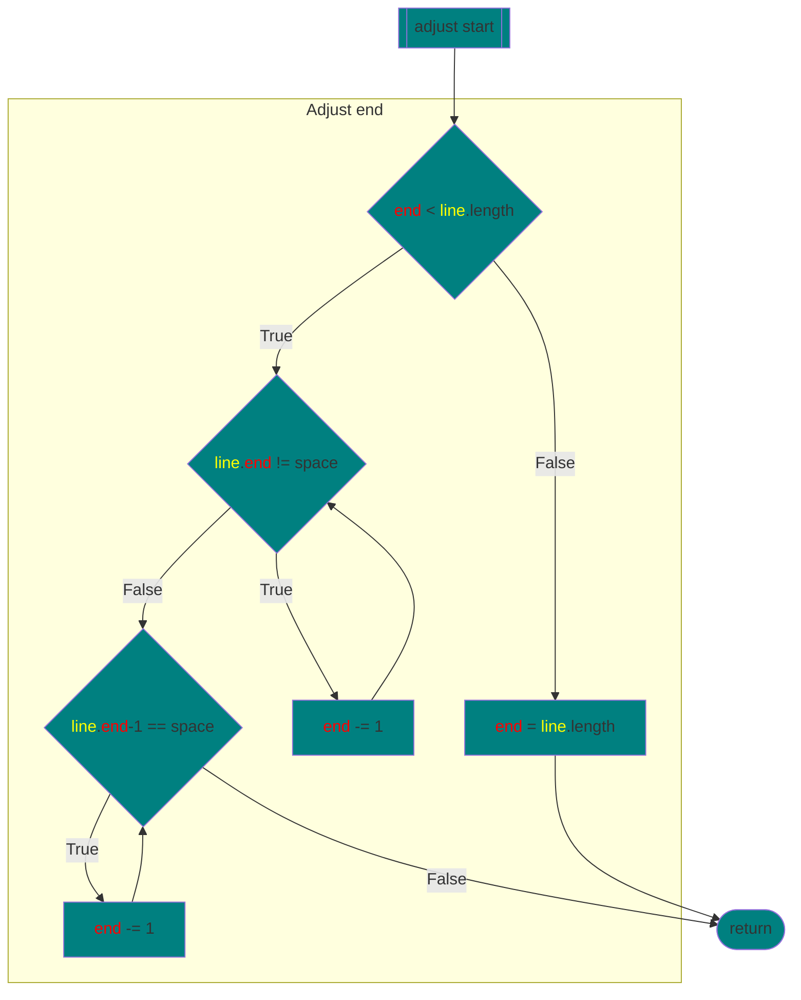
```
findBoundaries(columnIndex, positionsList, line)
    # Initial start and end positions
    SET start <- positionsList[columnIndex]
    IF columnIndex + 1 < positionsList.length
        SET end <- positionsList[columnIndex + 1]
    ELSE
        SET end <- line.length
    # Adjust start position
    IF start < line.length
        IF line[start] == " "
            WHILE start < end && line[start] == " "
                start += 1
        ELSE
            WHILE start > 0 && line[start - 1] != " "
                start -= 1
    ELSE
        start = line.length
    # Adjust end position
    IF end < line.length
        WHILE end > start && line[end] != " "
            end -= 1
        WHILE end > start && line[end - 1] == " "
            end -= 1
    ELSE:
        end = line.length
    RETURN start, end
```
[️⬆️](#initialize-table-methods)
---
##### `_addRjustColLabel`
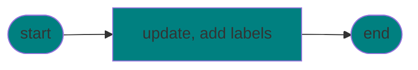
```
addRjustColLabel(label)
    IF label IS TYPE list, set
        UPDATE self.rightJustifiedColumns WITH label
    ELSE
        ADD label TO self.rightJustifiedColumns
```
[️⬆️](#initialize-table-methods)
---
#### Modify Table Methods
* [filterNonempty](#filternonempty)
* [filterStartswith](#filterstartswith)
* [resizeColumns](#resizecolumns)

[️⬆️](#method-groups)
---
##### `filterNonempty`
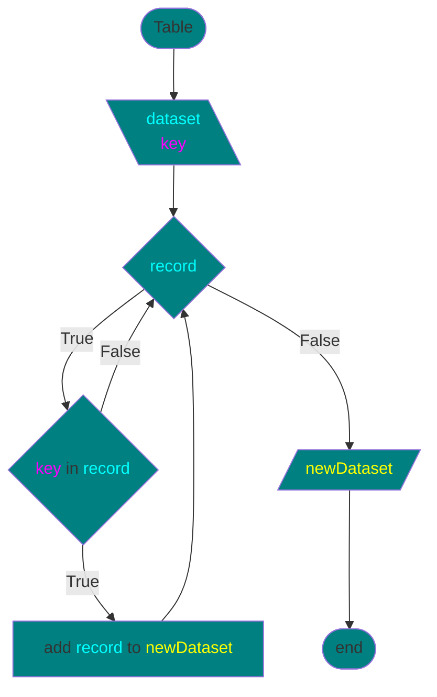
```
filterNonempty(key)
    SET newDataset <- []
    FOR record IN self.dataset
        IF key NOT IN record
            APPEND record TO newDataset
    SET self.dataset <- newDataset
    SET self.recordsCount <- self.dataset.length
```
[️⬆️](#modify-table-methods)
---
##### `filterStartswith`
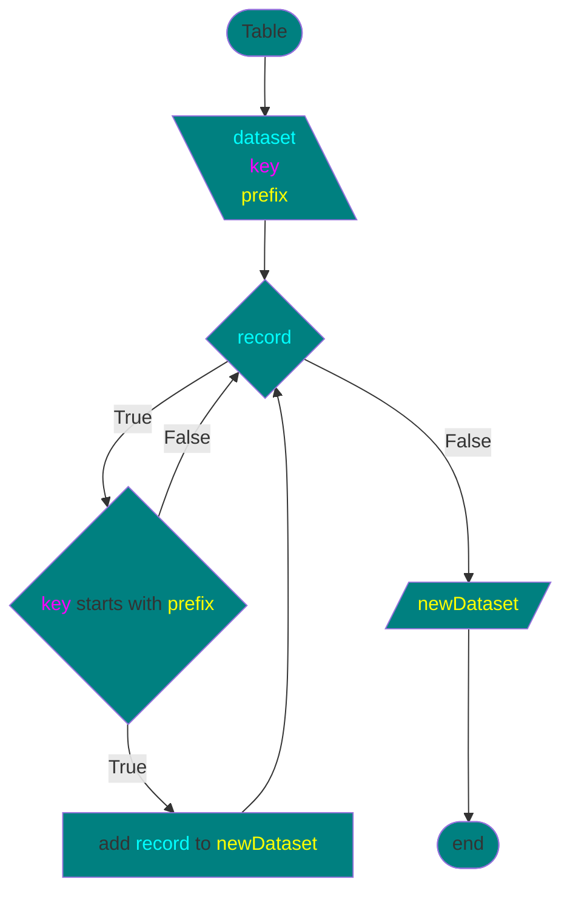
```
filterStartswith(key, prefix)
    SET newDataset <- []
    FOR record IN self.dataset
        IF key STARTSWITH prefix
            APPEND record TO newDataset
    SET self.dataset <- newDataset
    SET self.recordsCount <- self.dataset.length
```
[️⬆️](#modify-table-methods)
---
##### `resizeColumns`
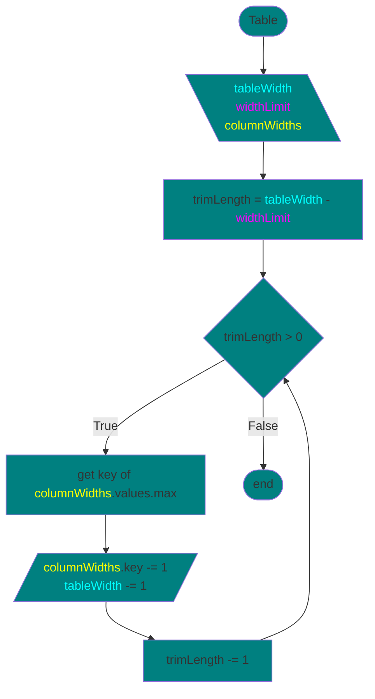
```
resizeColumns(widthLimit)
    SET trimLength <- self.tableWidth - widthLimit
    WHILE trimLength > 0
        SET maxWidth <- 0
        FOR key, value IN self.columnWidths
            IF value > maxWidth
                SET widestColumn <- key
        self.columnWidth[widestColumn] -= 1
        self.tablewidth -= 1
        trimLength -= 1
```
[️⬆️](#modify-table-methods)
---
#### Display Table Methods
* [putTable](#puttable)
* [_numberRecords](#_numberrecords)
* [_calculateWidths](#_calculatewidths)
* [_addRjustColLabel](#_addrjustcollabel) (see Initialize Table Methods)

[️⬆️](#method-groups)
---
##### `putTable`
* [ConsoleTable](../console/console_table.py)
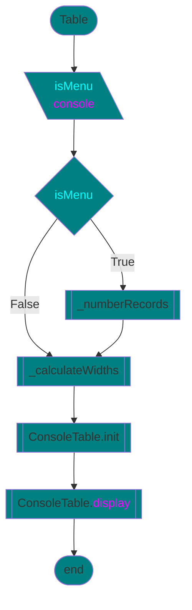
```
putTable(console, isMenu)
    IF isMenu
        CALL self.numberRecords
    CALL self.calculateWidths
    SET table <- ConsoleTable
    CALL table.display(console)
```
[️⬆️](#display-table-methods)
---
##### `_numberRecords`
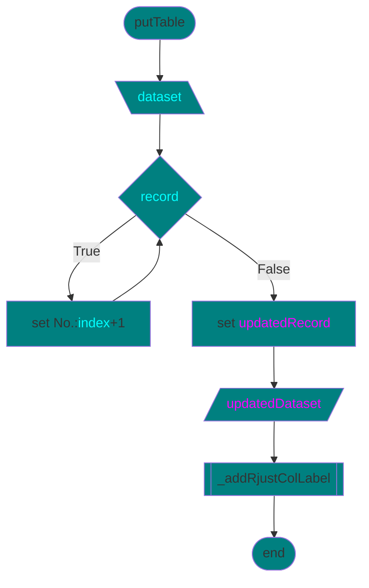
```
numberRecords()
    FOR index, record IN dataset
        SET key, value <- "#", index + 1
        SET updatedRecord <- key:value + record
        ADD updatedRecord <- newDataset
    CALL self.addRjustColLabel("#")
END
```
[️⬆️](#display-table-methods)
---
##### `_calculateWidths`
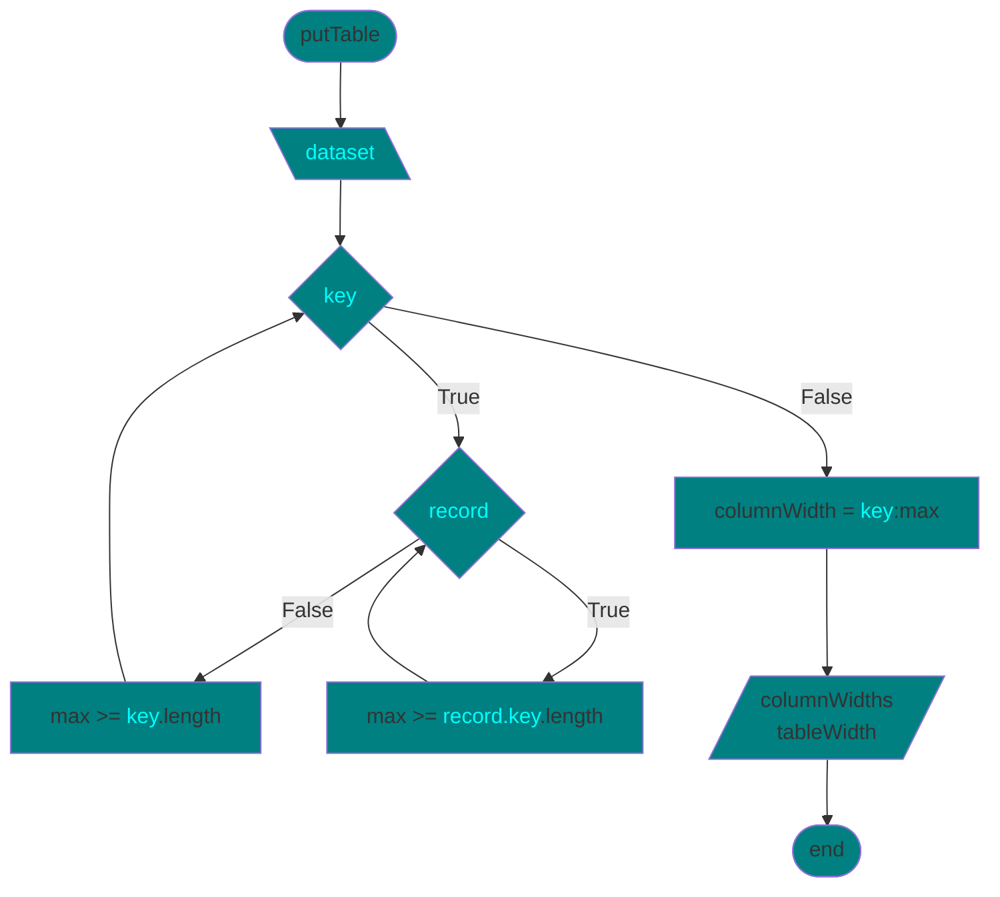
```
calculateWidths()
    FOR key IN dataset.keys
        SET max <- 0
        FOR record IN dataset
            IF record[key].length > max
                max <- record[key].length
        IF key.length > max
            max <- key.length
    SET columnWidth <- key:value
    ADD columnWidth TO columnWidths
    SET tableWidth <- columnWidths.values.sum + 2 * (columnWidths.length - 1)
END
```
[️⬆️](#display-table-methods)
---
#### Getters
* [countRecors](#countrecords)
* [getColumnWidts](#getcolumnwidths)
* [getHeadings](#getheadings)
* [getRecord](#getrecord)
* [getRjustColumns](#getrjustcolumns)
* [getTableWidth](#gettablewidth)
* [getTitle](#gettitle)

[️⬆️](#method-groups)
---
##### `countRecords`
```
countRecords()
    RETURN self.recordsCount
```
[️⬆️](#getters)
---
##### `getColumnWidths`
```
getColumnWidths()
    RETURN self.columnWidths
```
[️⬆️](#getters)
---
##### `getHeadings`
```
getHeadings()
    FOR key IN dataset.keys
        heading <- key:key
    ADD heading TO headings
    RETURN headings
```
[️⬆️](#getters)
---
##### `getRecord`
```
getRecord(index)
    IF index < 0 OR index >= self.dataset.length
        RAISE IndexError
    RETURN self.dataset[index]
```
[️⬆️](#getters)
---
##### `getRjustColumns`
```
getRjustColumns()
    RETURN self.rightJustifiedColumns
```
[️⬆️](#getters)
---
##### `getTableWidth`
```
getTableWidth()
    RETURN self.tableWidth
```
[️⬆️](#getters)
---
##### `getTitle`
```
getTitle()
    RETURN self.Title
```
[️⬆️](#getters)
---