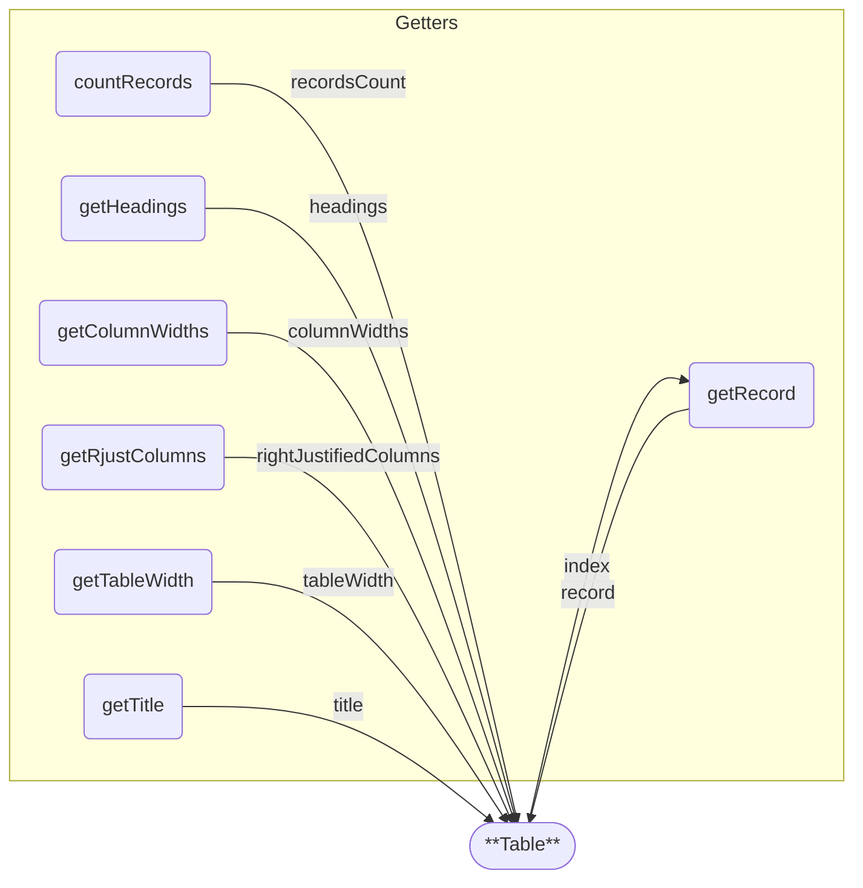

# Table Module
## `Table`
### Method Groups
* [Initialize Table Methods](#initialize-table-methods)
* [Modify Table Methods](#modify-table-methods)
* [Display Table Methods](#display-table-methods)
* [Getters](#getters)
#### Initialize Table Methods
* [\_\_init__](#__init__)
* [_capitalizeKeys](#_capitalizekeys)
* [_readTable](#_readtable)
* [_findColumnPositions](#_findcolumnpositions)
* [_getSlice](#_getslice)
* [_findBoundaries](#_findboundaries)
* [_addRjustColLabel](#_addrjustcollabel)

[️⬆️](#method-groups)
---
##### `__init__`

```
init(tableData, tableString, title, rjustColLabel)
    IF (tableData IS None) == (tableString IS None)
        RAISE ValueError
    IF tableData
        CALL capitalizeKeys
    ELSE
        CALL readTable
    SET title
    SET rjustColumns
    IF rjustColLabel
        CALL addRjustColLabel
END
```
[️⬆️](#initialize-table-methods)
---
##### `_capitalizeKeys`

```
capitalize_keys(data)
    SET self.dataset <- []
    FOR datum IN data
        FOR key, value IN datum
            SET datum[key.upper] <- value
        APPEND datum TO self.dataset
    SET self.recordsCount <- self.dataset.length
```
[️⬆️](#initialize-table-methods)
---
##### `_readTable`

```
readTable(string)
    SET lines <- string.splitlines
    SET headers <- lines[0].split
    SET columnPositions <- findColumnPositions()
    FOR line IN lines
        FOR header, index in headers
            SET value <- getSlice()
            SET datum[header.upper] <- value
        APPEND datum TO self.dataset
    SET self.recordsCount <- self.dataset.length
```
[️⬆️](#initialize-table-methods)
---
##### `_findColumnPositions`

```
findColumnPositions(headerLine, keys)
    SET positions <- []
    FOR key IN keys
        SET position <- headerLine.index OF key
        APPEND position TO positions
    RETURN positions
```
[️⬆️](#initialize-table-methods)
---
##### `_getSlice`

```
getSlice(columnIndex, positionsList, line)
    SET start, end <- findBoundaries(columnIndex, positionsList, line)
    RETURN line[start:end]
```
[️⬆️](#initialize-table-methods)
---
##### `_findBoundaries`
###### Overview

###### Initialize Subgraph

###### Start Subgraph

###### End Subgraph

```
findBoundaries(columnIndex, positionsList, line)
    # Initial start and end positions
    SET start <- positionsList[columnIndex]
    IF columnIndex + 1 < positionsList.length
        SET end <- positionsList[columnIndex + 1]
    ELSE
        SET end <- line.length
    # Adjust start position
    IF start < line.length
        IF line[start] == " "
            WHILE start < end && line[start] == " "
                start += 1
        ELSE
            WHILE start > 0 && line[start - 1] != " "
                start -= 1
    ELSE
        start = line.length
    # Adjust end position
    IF end < line.length
        WHILE end > start && line[end] != " "
            end -= 1
        WHILE end > start && line[end - 1] == " "
            end -= 1
    ELSE:
        end = line.length
    RETURN start, end
```
[️⬆️](#initialize-table-methods)
---
##### `_addRjustColLabel`

```
addRjustColLabel(label)
    IF label IS TYPE list, set
        UPDATE self.rightJustifiedColumns WITH label
    ELSE
        ADD label TO self.rightJustifiedColumns
```
[️⬆️](#initialize-table-methods)
---
#### Modify Table Methods
* [filterNonempty](#filternonempty)
* [filterStartswith](#filterstartswith)
* [resizeColumns](#resizecolumns)

[️⬆️](#method-groups)
---
##### `filterNonempty`

```
filterNonempty(key)
    SET newDataset <- []
    FOR record IN self.dataset
        IF key NOT IN record
            APPEND record TO newDataset
    SET self.dataset <- newDataset
    SET self.recordsCount <- self.dataset.length
```
[️⬆️](#modify-table-methods)
---
##### `filterStartswith`

```
filterStartswith(key, prefix)
    SET newDataset <- []
    FOR record IN self.dataset
        IF key STARTSWITH prefix
            APPEND record TO newDataset
    SET self.dataset <- newDataset
    SET self.recordsCount <- self.dataset.length
```
[️⬆️](#modify-table-methods)
---
##### `resizeColumns`
```mermaid
```
```
resizeColumns(widthLimit)
    # Calculate the total width to trim
        trim_length = self._table_width - width_limit
        # Continue trimming column widths until the trim length is 
        # satisfied
        while trim_length > 0:
            # Find the column with the maximum width
            widest_column = max(self._column_widths, 
                                key=self._column_widths.get)
            # Reduce the width of the widest column
            self._column_widths[widest_column] -= 1
        
            # Update the total width to be trimmed
            trim_length -= 1
            # Update the current table width
            self._table_width -= 1
```
[️⬆️](#modify-table-methods)
---
#### Display Table Methods
* [putTable](#puttable)
* [_numberRecords](#_numberrecords)
* [_calculateWidths](#_calculatewidths)
* [_addRjustColLabel](#_addrjustcollabel) (see Initialize Table Methods)

[️⬆️](#method-groups)
---
##### `putTable`
```
    def put_table(self, 
                  console: Terminal,
                  is_menu: bool = False) -> None:
        """Format and display a table with the given dataset.
        Args:
            console (Terminal): The Terminal object used for displaying 
                the table.
            is_menu (bool, optional): Whether the table is being 
                displayed as a menu. Defaults to False.
        """
        if is_menu:
            self._number_records()
        self._calculate_widths()
        # Create an instance of Console_Table with the current 
        # instance's data
        table = Console_Table(self)
        # Display the table using the provided Terminal object
        table.display(console)
```
[️⬆️](#display-table-methods)
---
##### `_numberRecords`
```
    def _number_records(self) -> None:
        """Add a numerical index to each record in the dataset and 
            update column labels.
        This method adds a numerical index to each record in the 
        dataset, with the index starting at 1. It also updates the 
        column labels to ensure proper right-justification for the index 
        column.
        """
        # Add a numerical index to each record, starting from 1
        self._dataset = [{"#": i + 1, **record} 
                         for i, record in enumerate(self._dataset)]
        # Update the column label for the index to ensure right-
        # justification
        self._add_rjust_col_label("#")
```
[️⬆️](#display-table-methods)
---
##### `_calculateWidths`
```
    def _calculate_widths(self) -> None:
        """Calculate the width of each column and the total table width 
            based on the dataset.
        Updates:
            Updates self._column_widths with the width of each column.
            Updates self._table_width with the total width of the table 
                including column separators.
        """
        self._column_widths = {
            key: max(len(key), 
                     max(len(str(record[key])) for record in self._dataset))
            for key in self._dataset[0].keys()
        }
        self._table_width = (sum(self._column_widths.values()) 
                             + 2 * (len(self._column_widths) - 1))
```
[️⬆️](#display-table-methods)
---
#### Getters
* [getRecord](#getrecord)
* [getTitle](#gettitle)
* [getHeadings](#getheadings)
* [getTableWidth](#gettablewidth)
* [getRjustColumns](#getrjustcolumns)

[️⬆️](#method-groups)
---
##### `getRecord`
```
    def get_record(self, index: int) -> dict[str, str]:
        """Retrieve a specific record from the dataset.
        Args:
            index (int): The index of the record to retrieve.
        Returns:
            dict[str, str]: The record at the specified index.
    
        Raises:
            IndexError: If the index is out of range of the dataset.
        """
        if index < 0 or index >= len(self._dataset):
            raise IndexError("Index out of range.")
        return self._dataset[index]
```
[️⬆️](#getters)
---
##### `getTitle`
```
    def get_title(self) -> str:
        """Return the title of the table.
        Returns:
            str: The title of the table.
        """
        return self._title
```
[️⬆️](#getters)
---
##### `getHeadings`
```
    def get_headings(self) -> dict[str, str]:
        """Return a dictionary of column headings where each key is 
            mapped to itself.
        Returns:
            dict[str, str]: A dictionary with column names as both keys 
                and values.
        """
        return {key: key for key in self._dataset[0].keys()}
```
[️⬆️](#getters)
---
##### `getTableWidth`
```
    def get_table_width(self) -> int:
        """Return the width of the table.
        Returns:
            int: The width of the table.
        """
        return self._table_width
```
[️⬆️](#getters)
---
##### `getRjustColumns`
```
    def get_rjust_columns(self) -> set[str]:
        """Return a set of column names that are right-justified.
        Returns:
            set[str]: A set of column names that are right-justified.
        """
        return self._right_justified_columns
```    def filter_nonempty(self, key: str) -> None:
        """Filter records to include only those where the value for the 
            specified key is non-empty.
        Args:
            key (str): The key in the records to check for non-empty 
                values.
        Updates:
            Filters self._dataset in place to include only records where 
            the value for the specified key is non-empty. Updates 
            self._records_count to reflect the new number of records.
        """
        self._dataset = [record for record in self._dataset 
                         if record.get(key.upper(), '').strip()]
        self._records_count = len(self._dataset)

[️⬆️](#getters)
---
##### `getColumnWidths`
```
    def get_column_widths(self) -> dict[str, int]:
        """Return a dictionary of column widths.
        Returns:
            dict[str, int]: A dictionary with column names as keys and 
                their widths as values.
        """
        return self._column_widths
```
##### `countRecords`
```
    def count_records(self) -> int:
        """Return the number of records in the dataset.

        Returns:
            int: The count of records.
        """
        return self._records_count
```