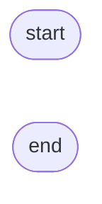

# Table Module
## `Table`
* [\_\_init__](#__init__)

[️⬆️](#table-module)
---
### `__init__`

```
init(tableData, tableString, title, rjustColumns)
    IF (tableData IS None) == (tableString IS None)
        RAISE ValueError
    IF tableData
        CALL capitalizeKeys
    ELSE
        CALL readTable
    SET title
    SET rjustColumns
END
```
[️⬆️](#table)
---
### `_capitalizeKeys`

[️⬆️](#table)
---
### `_readTable`
[️⬆️](#table)
